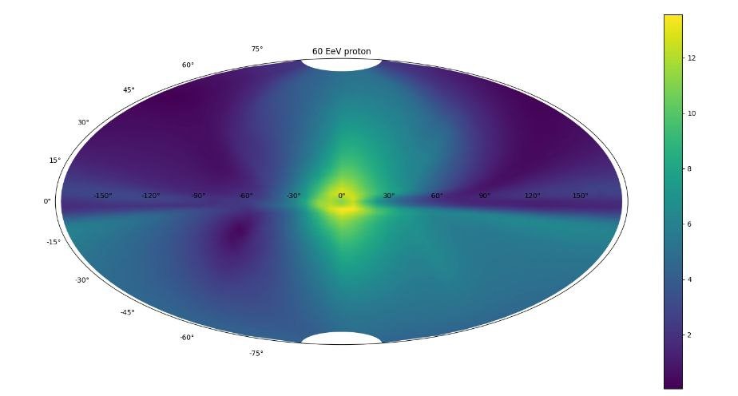

Example of GT in the Galaxy
---------

Consider a task of calculation of deflections angles of the 60 EeV protons in the galactic medium observed from the solar system (SS). 
To do so we generate numerous amount of protons near the SS and backtrace them into the outskirts of the galaxy (28.5 kpc from the SS).

To give that kind of break condition, we define the `R_max`-the maxium distance, and `BCcenter` - the point relative which `R_max` is calulated.

.. code-block:: python

    BreakConditions = [{'Rmax': 28.5*Units.kpc}, np.array([-8.5, 0, 0])*Units.kpc]

The trajectories are calculated in JF12mod field, without and distrubances in the field (as energy is too high and particles' diffusion is small).

.. code-block:: python

    Bfield = JF12mod(use_noise = False)

We define the `Flux` parameter to initialize particles. Unlike the example in the Magnetosphere_ example the backtracking is achieved with `"Mode": "Outward"`, while there
we used `ForwardTrck=-1`. Nevertheless the two methods are equivalent.

.. _Magnetosphere: Examples.Magnetosphere.html

.. code-block:: python

    InitialFlux =  Flux(Spectrum = Monolines(energy=60e3*Units.PeV), 
                        Distribution = SphereSurf(Center = np.array([-8.5,  0. ,  0. ])*Units.kpc, Radius=0),
                        Nevents= 100, 
                        Mode = 'Outward',
                        Names = 'pr')

.. code-block:: python

    import os
    import argparse

    import numpy as np
    from datetime import datetime

    from Global import Regions, Units
    from GT.Algos import BunemanBorisSimulator
    from Particles import Flux
    from Particles.Generators import Monolines, SphereSurf
    from MagneticFields.Galaxy import JF12mod

    parser = argparse.ArgumentParser()
    parser.add_argument("--folder")
    parser.add_argument("--seed", type=int)

    args = parser.parse_args()
    folder = args.folder
    seed = args.seed
    R = args.R

    np.random.seed(seed)
    Region = Regions.Galaxy
    Bfield = JF12mod(use_noise = False)

    Date = datetime(2008, 1, 1)

    Medium = None
    InitialFlux =  Flux(Spectrum = Monolines(energy=60e3*Units.PeV), 
                        Distribution = SphereSurf(Center = np.array([-8.5,  0. ,  0. ])*Units.kpc, Radius=0),
                        Nevents= 100, 
                        Mode = 'Outward',
                        Names = 'pr')
    UseDecay = False
    NuclearInteraction = None

    Nfiles = 100
    Output = f"{folder}" + os.sep + "Dir"
    Save = [1000, {"Angles": True, "Clock": True}]

    Verbose = True

    BreakConditions = [{'Rmax': 28.5*Units.kpc}, np.array([-8.5, 0, 0])*Units.kpc]

    simulator = BunemanBorisSimulator(Date=Date, Region=Region, Bfield=Bfield, Medium=Medium, Particles=InitialFlux, Num=int(100000000),
                                    Step=1000000, Save=Save, Nfiles=Nfiles, Output=Output, Verbose=Verbose, UseDecay=UseDecay,
                                    InteractNUC=NuclearInteraction, BreakCondition=BreakConditions)
    simulator()

By calculting the :math:`\arccos\frac{\vec{v}_0\cdot(\vec{r}_f - \vec{r}_i)}{|\vec{r}_f - \vec{r}_i|}`, we find the deflection angle.
Here :math:`\vec{v}_0` is the normalized initial velocity, :math:`\vec{r}_f` and :math:`\vec{r}_i` are final and inital coordinates respectively.
The image shows the deflection angles depenadacne from the direction, the color corresponds to the angle in degress.

