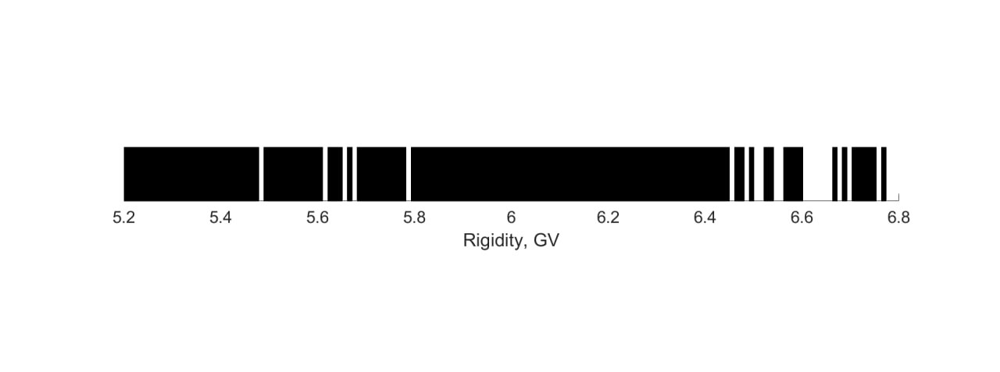

Example of GT in the Magnetosphere
---------

Consider the task of the calculation of the cut-off rigidity of antiprotons at altitude of 400 km, null meridian,
and 40 degrees northern latitude in a vertical direction. These coordinates correspond to :math:`\vec{r} = (0.8139, 0, 0.6829)`
radius of earth, and the velocity along :math:`-\vec{r}`. Calculations are done in IGRF13 field. These initial parameters correspond to

.. code-block:: python

    Bfield = ["Gauss", {'model': "IGRF", "model_type": "core", "version": 13}]

where the first element, is
the set of magentic fields calculated via *Gauss* parameters, and the `'model': "IGRF"`, tells GT to use the parameters for
IGRF (an alternative for the magentic field is `Bfield = "Dipole"`, where we consider the magnetic field of a dipole),
`Flux` parameters which defines the kinetic energies of the particles

.. code-block:: python

    "T": np.linspace(4.30, 6.00, 171) * Units.GeV
their velocity

.. code-block:: python

    "V0": np.array([-0.8139, 0, -0.6829])

and the initial position

.. code-block:: python

    {"Center": np.array([0.8139, 0, 0.6829]) * Units.RE, "Radius": 0}

The particles are generated on the surface of a sphere centered in the `Center` and radius of `Radius`.

.. code-block:: python

    import os
    import numpy as np
    from datetime import datetime

    from Global import Regions, Units
    from GT.Algos import BunemanBorisSimulator

    Region = Regions.Magnetosphere
    Bfield = ["Gauss", {'model': "IGRF", "model_type": "core", "version": 13}]
    Date = datetime(2006, 6, 15)

    Medium = None

    Flux = {"T": np.linspace(4.30, 6.00, 171) * Units.GeV,
            "Names": "apr",
            "Center": np.array([0.8139, 0, 0.6829]) * Units.RE,
            "Radius": 0,
            "V0": np.array([-0.8139, 0, -0.6829]),
            "Nevents": 171}
    UseDecay = False
    NuclearInteraction = None

    Nfiles = 1
    Output = "IGRFSteps" + os.sep + "IGRF_Step5e-6"
    Save = [4, {"Bfield":True}]
    Verbose = True
    BreakConditions = {"Rmin": 1 * Units.RE2km, "Rmax": 10 * Units.RE2km, "MaxPath": 1000 * Units.RE2km}
    simulator = BunemanBorisSimulator(Date=Date,
                                      Region=Region,
                                      Bfield=Bfield,
                                      Particles=Flux,
                                      Num=int(5e7),
                                      Step=5e-6,
                                      Save=Save,
                                      Nfiles=Nfiles,
                                      Output=Output,
                                      Verbose=Verbose,
                                      BreakCondition=BreakConditions,
                                      ForwardTrck=-1)
    simulator()

The methodology of calculation of cut-off is the following. We backtrace the particle, and see whether it falls onto the earth,
gets captured or leaves the magnetosphere. To turn on backtracking regime we pass in `BunemanBorisSimulator(ForwardTrack=-1)`.
These conditions are written in `BreakConditions` respectively.

.. code-block:: python

    BreakConditions = {"Rmin": 1 * Units.RE, "MaxPath": 1000 * Units.RE, "Rmax": 10 * Units.RE}

The particles that statisfy the first or the second condition, then these particles cannot be revered and the trajectories are forbidden.
On the plot they are showed in black. Otherwise, the particles and reach the altitude from outside the magnetosphere, hence those are
allowed trajectories (white lines on the plot).

